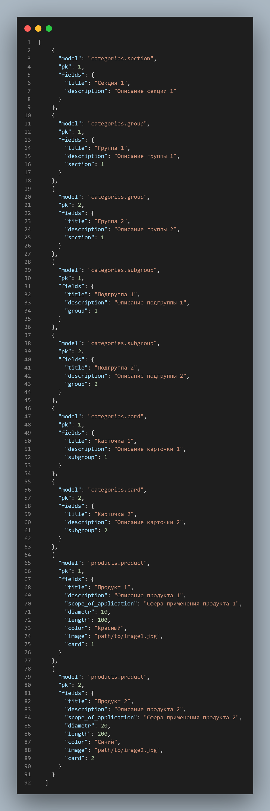

# foodgram


___

#### Вашему вниманию представляется иерфрхическая структура товаров. Программа имеет модели базы данных такие как: 
* `Product` - модель продукта
* `Section` - секции продукта
* `Group` - группа продукта
* `Subgroup` - поддгруппа продкта
* `Card` - карточка на котрую ссыдается продукт

##### База данных имеет 4 уровня вложенности `section-group-subgroup-card` 
___
### Содержание:
* [Запуск]()
* [Переменные окружения]()
* [Как добавить данные]()
* [Эндпоинты и их функции]()
* [Цель проекта]()
___
### Запуск

Для запуска у вас уже должен быть установлен Python 3.9 или выше.

- Скачайте код
- Установите зависимости командой `pip install -r requirements.txt`
- Запустите сервер командой `python3 manage.py runserver`
___
### Переменные окружения:

Часть настроек проекта берётся из переменных окружения. Чтобы их определить, создайте файл `.env` рядом с `manage.py` и запишите туда данные в таком формате: `ПЕРЕМЕННАЯ=значение`.

**Для запуска проекта эти настройки не требуются**, значения уже проставлены по умолчанию.

Доступны следущие переменные:
- `DEBUG` — дебаг-режим. Поставьте `True`, чтобы увидеть отладочную информацию в случае ошибки. Выключается значением `False`.
- `SECRET_KEY` — секретный ключ проекта. Например: `erofheronoirenfoernfx49389f43xf3984xf9384`.
___
### Как добавить данные

Можно использовать два способа, для добавления данных в `БД` - это через админку и напрямую через кансоль.

##### Добавление через админ панель

Для того чтобы добавить данные через админку, потребуется для начала добавить `секцию`, затем `группу`, `подруппу`, `карточку`, после же добавляем сам `продукт`.

* При добавлении записи о группе, подгруппе и тд. требуется указать к какому предыдущему объекту будет привязка.

##### Добавление через консоль

В `Django` существует встренная команда для добавления данных в базу. Достаточно написать в консоль команду:
```
python manage.py loaddata fixture_name
```
* Прежде чем писать данную команду, требуется создать файл `json` в котором буду написаны данные.

* Пример файла `json`:


* Подробнее о [loaddata](https://www.pythontutorial.net/django-tutorial/django-loaddata/)

___
### Эндпоинты и их функции


___

### Цель проекта:
* Код написан в образовательных целях.
